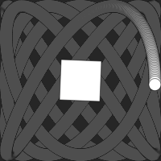

# Oliver's p5.js Libraries

This repository contains libraries for [p5.js](https://p5js.org). Each library
has its own documentation page; click on the library name for additional
documentation, examples, and installation instructions.

## The Libraries

### [p5.layers](./p5.layers/)

[p5.layers](./p5.layers/) adds functions that simplify the use of
  [createGraphics](https://p5js.org/reference/#/p5/createGraphics) and [p5.js
  Renders](https://p5js.org/reference/#/p5.Renderer) objects. It makes it easier
  to use Graphics objects to implement drawing layers, and it removes the need
  to add or remove the "`g.`" prefix from draw calls in order to change them
  between drawing on the canvas, versus drawing on a instance of `Graphics`.

```js
function draw() {
  beginLayer();
  background(100);
  fill('blue');
  circle(width / 2, height / 2, 100);
  endLayer();
}
```




* [Examples](./p5.layers/examples)

### [p5.rotate-about](./p5.rotate-about/)

[p5.rotate-about](./p5.rotate-about/) adds `rotateAbout()` and `scaleAbout()`
functions.

```js
function draw() {
  clear();

  const angle = radians(frameCount);
  rotateAbout(angle, 100, 200);

  square(10, 10, 50);
}
```

### [p5.vector-arguments](./p5.vector-arguments/)

[p5.vector-arguments](./p5.vector-arguments/) enables the use of [p5.js
Vectors](https://p5js.org/reference/#/p5/createVector) with the [p5.js Shape
functions](https://p5js.org/reference/#group-Shape).

```js
function draw() {
  let pt = createVector(mouseX, mouseY);
  circle(pt, 100);

  pt.add(100, 200);
  circle(pt, 50);
}
```

* [Examples](./p5.vector-arguments/examples)

## Installation

Each library includes instructions for adding it to an HTML file.

In additon, the [p5 server command-line
runner](https://osteele.github.io/p5-server/) and the [P5 Server Visual Studio
extension](https://marketplace.visualstudio.com/items?itemName=osteele.p5-server)
know about these libraries. A JavaScript-only sketch that uses one (or more) of
them will automatically include the library when it is run by one of these
tools.

## Keeping in Touch

Report bugs, features requests, and suggestions
[here](https://github.com/osteele/p5.libs/issues), or message me [on
Twitter](https://twitter.com/osteele).

Follow [@osteele on Twitter](https://twitter.com/osteele) for updates.

## Other Work

[https://code.osteele.com](https://code.osteele.com#p5-js) lists my other p5.js
projects. These include tools, libraries, and examples and educational
materials.

[P5.js notes](https://notes.osteele.com/p5js) has notes on learning and working
with p5.js
